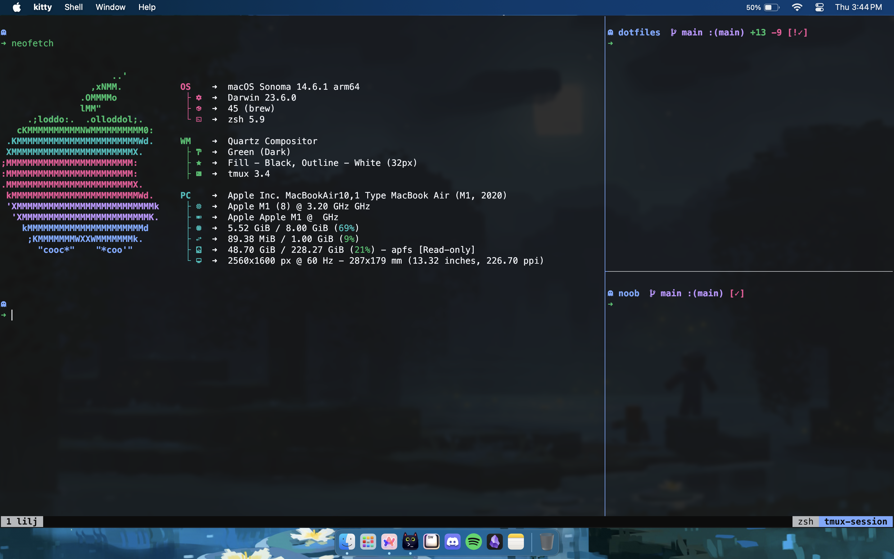

<h2 align="center">
    <b style="font-size:24px;line-height:24px;vertical-align:middle;">
        <i>JJs dotfiles</i>
    </b>
</h2>


<details>
    <summary>
        <b>Yabai tiling wm</b>
        <span style="font-size:14px;">(expand)</span>
    </summary>


    #### Bonus Kitty Becasue somehow even this theme looks better on Kitty than wezterm



</details>

### 🚀 Installation

1.Clone this repository.

```sh
git clone https://github.com/kulvirdotgg/dotFiles.git
```

2.Run `install.sh` script. (provide `--yabai` flag to install **yabai** tiling window manager)

```sh
cd dotFiles
./install.sh
```

### Manual setup thingies (Ice age things)
- [Arc](https://arc.net)
- Use Cool icons for terminal (Aplications > {app} > Content > Resrouces)
