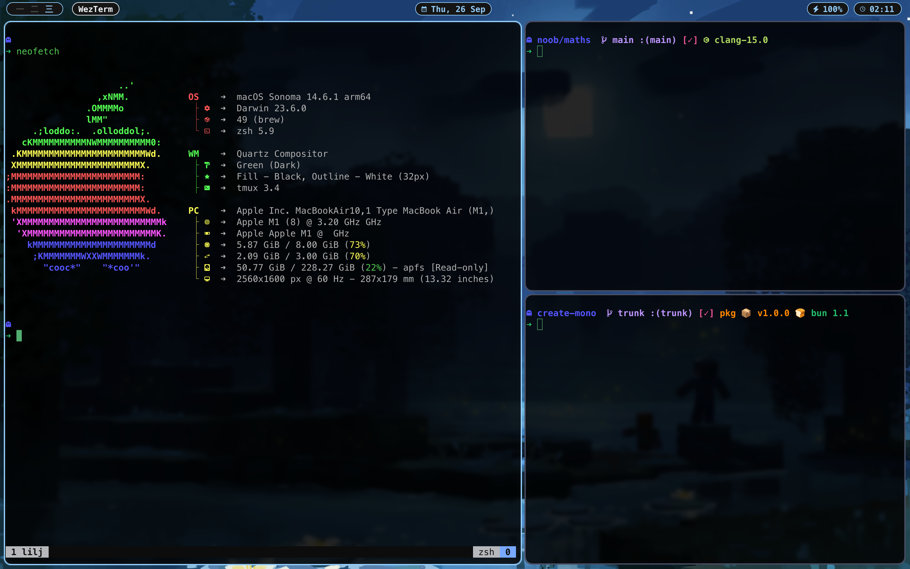
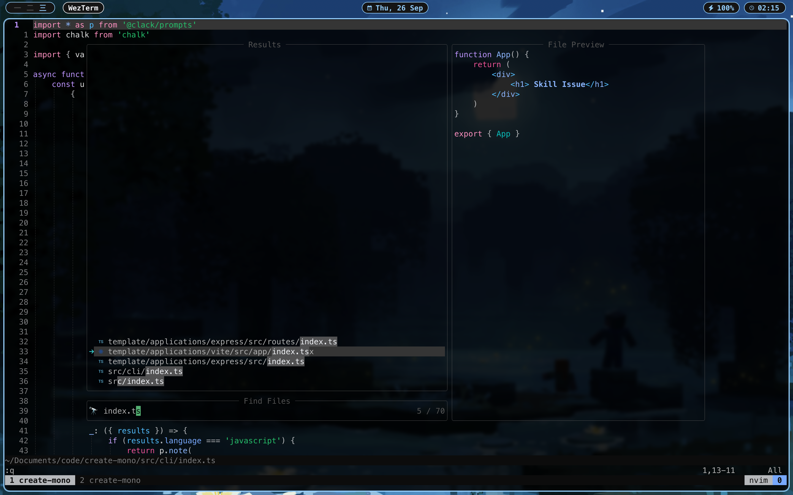

<h2 align="center">
    <b style="font-size:24px;line-height:24px;vertical-align:middle;">
        <i>JJs dotfiles</i>
    </b>
</h2>

### ScreenShot




<details>
    <summary>
        <b>Catpuccin Theme Setup</b>
        <span style="font-size:14px;">(expand)</span>
    </summary>


</details>

### 🚀 Installation

1.Clone this repository.

```
git clone https://github.com/kulvirdotgg/dotFiles.git
```

2.Run `install.sh` script. (provide `--yabai` flag to install **yabai** tiling window manager)

```
./install.sh
```
